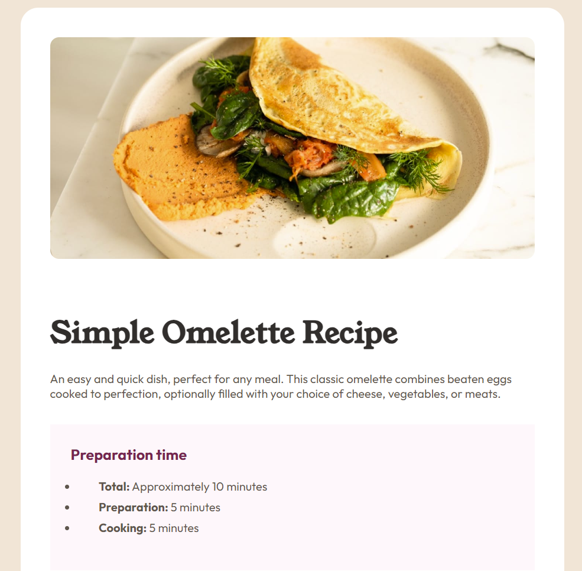
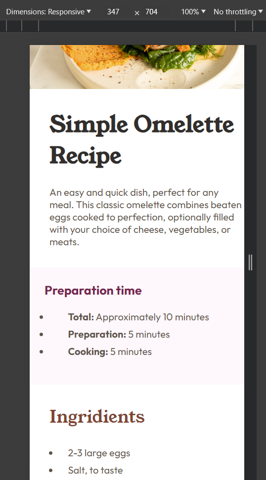

# Frontend Mentor - Recipe page solution

This is a solution to the [Recipe page challenge on Frontend Mentor](https://www.frontendmentor.io/challenges/recipe-page-KiTsR8QQKm). Frontend Mentor challenges help you improve your coding skills by building realistic projects. 

## Table of contents

- [Overview](#overview)
  - [The challenge](#the-challenge)
  - [Screenshot](#screenshot)
  - [Links](#links)
- [My process](#my-process)
  - [Built with](#built-with)
  - [What I learned](#what-i-learned)
  - [Continued development](#continued-development)
  - [Useful resources](#useful-resources)
- [Author](#author)
- [Acknowledgments](#acknowledgments)

**Note: Delete this note and update the table of contents based on what sections you keep.**

## Overview

### Screenshot

### Links

- Solution URL: [Add solution URL here](https://your-solution-url.com)
- Live Site URL: [Add live site URL here](https://your-live-site-url.com)

## My process

### Built with

- Semantic HTML5 markup
- Dart-SASS
- CSS Grid
- Desktop-first workflow

### What I learned

SASS, Mixins, @use, media queries:
$color-text-chapters: rgb(133, 70, 50);
$color-background: #F3E5D7;
$color-background-page: hsl(0, 0%, 100%);
$color-background-prep: rgb(255, 247, 251);

//media queries mixins
@mixin for-phone {
    @media (max-width:375px) {@content;}
}

Working with figma files (amazing experience)

### Continued development

Javascript and then React or Vue, TBD
### Useful resources

https://dev.to/rembertdesigns/how-to-write-media-queries-with-sass-mixins-32e - writing SASS Mixin for media queries

## Author

- Website - Ruslan Amrahov

## Acknowledgments

This is where you can give a hat tip to anyone who helped you out on this project. Perhaps you worked in a team or got some inspiration from someone else's solution. This is the perfect place to give them some credit.

**Note: Delete this note and edit this section's content as necessary. If you completed this challenge by yourself, feel free to delete this section entirely.**
